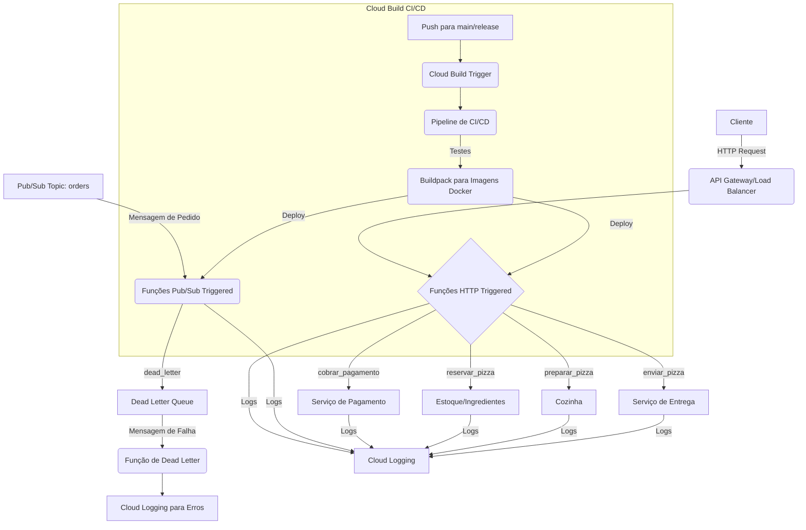

# Projeto Final: Delivery de Pizza com Funções Serverless e CI/CD no GCP

Este projeto demonstra uma arquitetura serverless para um sistema de delivery de pizza, utilizando Cloud Run Functions no Google Cloud Platform (GCP). O projeto inclui funções para lidar com diferentes etapas do pedido de pizza e um pipeline de CI/CD robusto para automação de testes e deployments.

## 1. Arquitetura do Sistema

A arquitetura do sistema é baseada em funções serverless orquestradas por eventos.



## 2. Funções Serverless

O projeto contém as seguintes funções, localizadas em `functions/`:

-   **`cobrar_pagamento` (HTTP Triggered):** Processa o pagamento de um pedido.
-   **`reservar_pizza` (HTTP Triggered):** Simula a reserva de ingredientes para um pedido.
-   **`preparar_pizza` (HTTP Triggered):** Simula o preparo da pizza.
-   **`enviar_pizza` (HTTP Triggered):** Simula o envio da pizza.
-   **`dead_letter` (Pub/Sub Triggered):** Processa mensagens que falharam em outras filas (Dead Letter Queue).

Cada função é implantada como um serviço no Cloud Run (2ª Geração) e utiliza uma Service Account de menor privilégio para suas operações.

## 3. Pipeline de CI/CD

O pipeline de CI/CD é configurado através do `cloudbuild.yaml` e automatiza o processo de desenvolvimento e implantação:

1.  **Gatilho:** Ativado em cada `push` para as branches `main` e `release` no repositório Git.
2.  **Testes:** Cada função possui um estágio de teste (atualmente um placeholder) para garantir a qualidade do código.
3.  **Build e Push (via Buildpacks):** O Cloud Build utiliza o Buildpacks para criar automaticamente imagens Docker para cada função a partir do código-fonte e as envia para o Artifact Registry. Isso dispensa a necessidade de `Dockerfile`s manuais e acelera o processo.
4.  **Deploy:** As funções são implantadas ou atualizadas no Cloud Run. Cada função é associada à sua Service Account dedicada.

### Service Accounts e Secret Manager

-   **Service Accounts Dedicadas:** Cada função (`sa-cobrar-pagamento`, `sa-dead-letter`, etc.) tem uma Service Account com permissões mínimas (`logging.logWriter` e `pubsub.subscriber` para `dead_letter`) para garantir segurança.
-   **Secret Manager:** A chave da API de pagamento (`PAYMENT_API_KEY`) é armazenada de forma segura no Secret Manager e injetada na função `cobrar_pagamento` no momento do deploy, garantindo que credenciais sensíveis nunca estejam no código-fonte.

## 4. Como Testar o Projeto

Para testar o projeto, siga os passos abaixo. Certifique-se de ter o `gcloud CLI` configurado e autenticado em seu projeto GCP (`project-62f09b8b-cbd8-428e-8f5`).

### 4.1. Configuração Inicial (Executar uma vez)

1.  **Habilitar APIs necessárias:**
    ```bash
    gcloud services enable run.googleapis.com \
                           cloudbuild.googleapis.com \
                           pubsub.googleapis.com \
                           secretmanager.googleapis.com \
                           logging.googleapis.com
    ```

2.  **Criar o tópico Pub/Sub para Dead Letter Queue:**
    ```bash
    gcloud pubsub topics create dead-letter-topic --project project-62f09b8b-cbd8-428e-8f5
    ```

3.  **Criar Service Accounts e vincular permissões:**
    _As Service Accounts e suas permissões já foram criadas e configuradas durante a configuração inicial do projeto. Se precisar recriar, utilize os comandos abaixo substituindo `project-62f09b8b-cbd8-428e-8f5` pelo seu Project ID._

    ```bash
    gcloud iam service-accounts create sa-cobrar-pagamento --display-name "Service Account for cobrar_pagamento function" --project project-62f09b8b-cbd8-428e-8f5
    gcloud projects add-iam-policy-binding project-62f09b8b-cbd8-428e-8f5 --member "serviceAccount:sa-cobrar-pagamento@project-62f09b8b-cbd8-428e-8f5.iam.gserviceaccount.com" --role "roles/logging.logWriter" --project project-62f09b8b-cbd8-428e-8f5

    gcloud iam service-accounts create sa-dead-letter --display-name "Service Account for dead_letter function" --project project-62f09b8b-cbd8-428e-8f5
    gcloud projects add-iam-policy-binding project-62f09b8b-cbd8-428e-8f5 --member "serviceAccount:sa-dead-letter@project-62f09b8b-cbd8-428e-8f5.iam.gserviceaccount.com" --role "roles/logging.logWriter" --project project-62f09b8b-cbd8-428e-8f5
    gcloud projects add-iam-policy-binding project-62f09b8b-cbd8-428e-8f5 --member "serviceAccount:sa-dead-letter@project-62f09b8b-cbd8-428e-8f5.iam.gserviceaccount.com" --role "roles/pubsub.subscriber" --project project-62f09b8b-cbd8-428e-8f5

    gcloud iam service-accounts create sa-enviar-pizza --display-name "Service Account for enviar_pizza function" --project project-62f09b8b-cbd8-428e-8f5
    gcloud projects add-iam-policy-binding project-62f09b8b-cbd8-428e-8f5 --member "serviceAccount:sa-enviar-pizza@project-62f09b8b-cbd8-428e-8f5.iam.gserviceaccount.com" --role "roles/logging.logWriter" --project project-62f09b8b-cbd8-428e-8f5

    gcloud iam service-accounts create sa-preparar-pizza --display-name "Service Account for preparar_pizza function" --project project-62f09b8b-cbd8-428e-8f5
    gcloud projects add-iam-policy-binding project-62f09b8b-cbd8-428e-8f5 --member "serviceAccount:sa-preparar-pizza@project-62f09b8b-cbd8-428e-8f5.iam.gserviceaccount.com" --role "roles/logging.logWriter" --project project-62f09b8b-cbd8-428e-8f5

    gcloud iam service-accounts create sa-reservar-pizza --display-name "Service Account for reservar_pizza function" --project project-62f09b8b-cbd8-428e-8f5
    gcloud projects add-iam-policy-binding project-62f09b8b-cbd8-428e-8f5 --member "serviceAccount:sa-reservar-pizza@project-62f09b8b-cbd8-428e-8f5.iam.gserviceaccount.com" --role "roles/logging.logWriter" --project project-62f09b8b-cbd8-428e-8f5
    ```

4.  **Criar segredo `PAYMENT_API_KEY` (se não existir e ainda não tiver sido preenchido):**
    ```bash
    echo "SUA_CHAVE_AQUI" | gcloud secrets create PAYMENT_API_KEY --data-file=- --project project-62f09b8b-cbd8-428e-8f5
    ```
    **IMPORTANTE:** Substitua `"SUA_CHAVE_AQUI"` pela chave de API de pagamento real ou um valor de teste.

5.  **Conceder permissão ao Cloud Build para acessar o Secret Manager:**
    _Este passo também já foi realizado. Se precisar recriar, utilize:_
    ```bash
    PROJECT_NUMBER=$(gcloud projects describe project-62f09b8b-cbd8-428e-8f5 --format="value(projectNumber)")
    CLOUD_BUILD_SA="${PROJECT_NUMBER}@cloudbuild.gserviceaccount.com"
    gcloud projects add-iam-policy-binding project-62f09b8b-cbd8-428e-8f5 --member="serviceAccount:$CLOUD_BUILD_SA" --role="roles/secretmanager.secretAccessor" --project project-62f09b8b-cbd8-428e-8f5
    ```

### 4.2. Deploy das Funções via CI/CD (Gatilho Cloud Build)

1.  **Crie o Trigger do Cloud Build (manual ou via console):**
    *   No console do GCP, navegue até **Cloud Build** > **Triggers**.
    *   Crie um novo trigger:
        *   **Name:** `pizza-delivery-ci-cd`
        *   **Event:** `Push to a branch`
        *   **Source:** Selecione seu repositório Git.
        *   **Branch:** `^main$|^release$` (Regex para `main` e `release`)
        *   **Build configuration:** `Cloud Build configuration file (yaml or json)`
        *   **Cloud Build file location:** `/cloudbuild.yaml`
        *   **Substitutions:** Adicione `_PROJECT_ID: project-62f09b8b-cbd8-428e-8f5`

2.  **Execute um push para a branch `main` ou `release`:**
    ```bash
    # Certifique-se de que todas as alterações (cloudbuild.yaml, README.md, etc.) estejam commitadas
    git add .
    git commit -m "feat: Adiciona CI/CD e documentação inicial"
    git push origin main
    ```
    O Cloud Build iniciará automaticamente o pipeline, que fará o deploy de todas as funções no Cloud Run.

### 4.3. Testando as Funções HTTP

Após o deploy das funções HTTP, obtenha as URLs dos serviços Cloud Run:

```bash
gcloud run services list --platform managed --region us-central1 --project project-62f09b8b-cbd8-428e-8f5
```

Substitua `YOUR_FUNCTION_URL` pela URL de cada função (cobrar-pagamento, enviar-pizza, preparar-pizza, reservar-pizza) nos exemplos abaixo:

-   **`cobrar_pagamento`:**
    ```bash
    curl -X POST YOUR_COBRAR_PAGAMENTO_URL \
         -H "Content-Type: application/json" \
         -H "Idempotency-Key: $(uuidgen)" \
         -d '{"amount": 29.99}'
    ```

-   **`reservar_pizza`:**
    ```bash
    curl -X POST YOUR_RESERVAR_PIZZA_URL \
         -H "Content-Type: application/json" \
         -d '{"order_id": "order-123", "items": ["pepperoni", "cheese"]}'
    ```

-   **`preparar_pizza`:**
    ```bash
    curl -X POST YOUR_PREPARAR_PIZZA_URL \
         -H "Content-Type: application/json" \
         -d '{"order_id": "order-123"}'
    ```

-   **`enviar_pizza`:**
    ```bash
    curl -X POST YOUR_ENVIAR_PIZZA_URL \
         -H "Content-Type: application/json" \
         -d '{"order_id": "order-123"}'
    ```

### 4.4. Testando a Função Pub/Sub (`dead_letter`)

1.  **Publique uma mensagem no tópico `dead-letter-topic`:**
    ```bash
    gcloud pubsub topics publish dead-letter-topic --message='{"error": "Simulated error for order-456"}' --project project-62f09b8b-cbd8-428e-8f5
    ```

2.  **Verifique os logs:** A função `dead_letter` deve ser acionada e você poderá ver as entradas de log no Cloud Logging.
    ```bash
    gcloud logging read "resource.type=cloud_run_revision AND resource.labels.service_name=dead-letter" --limit 10 --project project-62f09b8b-cbd8-428e-8f5
    ```

## 5. Próximos Passos (para desenvolvimento futuro)

-   Implementar testes unitários e de integração reais para cada função.
-   Adicionar um Workflow no Workflows para orquestrar as funções de pedido (reservar -> preparar -> cobrar -> enviar).
-   Configurar a segurança de acesso às funções (IAM para invocar).
-   Usar Terraform para gerenciar a infraestrutura (tópicos Pub/Sub, Service Accounts, Secrets, etc.).
