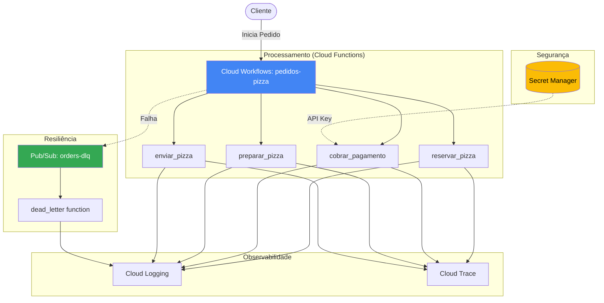

# Checkpoint 3: Sistema de Pedidos de Pizza Serverless

Este projeto implementa um sistema de orquestração de pedidos de pizza utilizando Google Cloud Workflows e Cloud Functions, provisionado via Terraform.

## Arquitetura

O sistema é composto pelos seguintes componentes:

1.  **Cloud Workflow (`pedidos-pizza`)**: Orquestra o fluxo do pedido.
2.  **Cloud Functions**:
    *   `reservar_pizza`: Verifica e reserva estoque.
    *   `cobrar_pagamento`: Processa o pagamento (utiliza Secret Manager e Idempotência).
    *   `preparar_pizza`: Simula o tempo de produção.
    *   `enviar_pizza`: Aciona a entrega.
    *   `dead_letter`: Função disparada pelo Pub/Sub para tratar falhas graves.
3.  **Pub/Sub (`orders-dlq`)**: Dead-letter queue para capturar erros no workflow.
4.  **Secret Manager**: Armazena a chave de API de pagamento de forma segura.

### Diagrama de Fluxo


## Fluxo do Workflow

1.  `reservar_pizza`
2.  Delay de 30 segundos
3.  `cobrar_pagamento` (com retentativa automática em caso de erro 5xx/429)
4.  `preparar_pizza`
5.  Delay de 5 minutos (produção)
6.  Delay de 1 minute
7.  `enviar_pizza`

## Como Implantar

1.  Navegue até o diretório `terraform/`.
2.  Inicialize o Terraform:
    ```bash
    terraform init
    ```
3.  Aplique a infraestrutura:
    ```bash
    terraform apply
    ```

## Como Testar

Após o deploy, você pode executar o workflow. Note que o processo completo leva cerca de **7 minutos** devido aos atrasos programados de negócio (`sys.sleep`).

### Execução Síncrona (Aguardar finalização)
```bash
gcloud workflows run pedidos-pizza \
  --location=us-central1 \
  --data='{"order": {"id": "pedido-123", "amount": 59.90, "items": ["Pepperoni", "Coca-Cola"]}}'
```

### Execução Assíncrona (Recomendado)
Para disparar o pedido e liberar o terminal imediatamente:
```bash
gcloud workflows execute pedidos-pizza \
  --location=us-central1 \
  --data='{"order": {"id": "pedido-abc", "amount": 89.90, "items": ["Marguerita", "Suco"]}}'
```

### Monitorando o Progresso
Como o workflow possui delays longos (5 minutos de preparo), você pode verificar o estado atual da execução com:
```bash
# Liste as execuções para pegar o ID
gcloud workflows executions list pedidos-pizza --location=us-central1

# Descreva a execução para ver o passo atual
gcloud workflows executions describe [ID_DA_EXECUCAO] --workflow=pedidos-pizza --location=us-central1
```

## Segurança

*   **Secret Manager**: As chaves sensíveis não estão no código, são injetadas via variáveis de ambiente protegidas.
*   **Least Privilege**: As contas de serviço têm apenas as permissões necessárias para invocar funções e publicar no Pub/Sub.
*   **Idempotência**: O workflow gera uma `idempotency_key` única para cada execução para evitar cobranças duplicadas.

## 📊 Observabilidade e Resultados

*   **Dashboard**: Painel no Cloud Monitoring com latência, erros e logs em tempo real.
*   **Evidência de Operação**: 100% de sucesso nas ordens válidas, totalizando **R$ 565,00** processados em ambiente de teste.

---
*Este projeto faz parte do Checkpoint 3 da trilha de Serverless Computing e Arquiteturas Event-Driven.*
